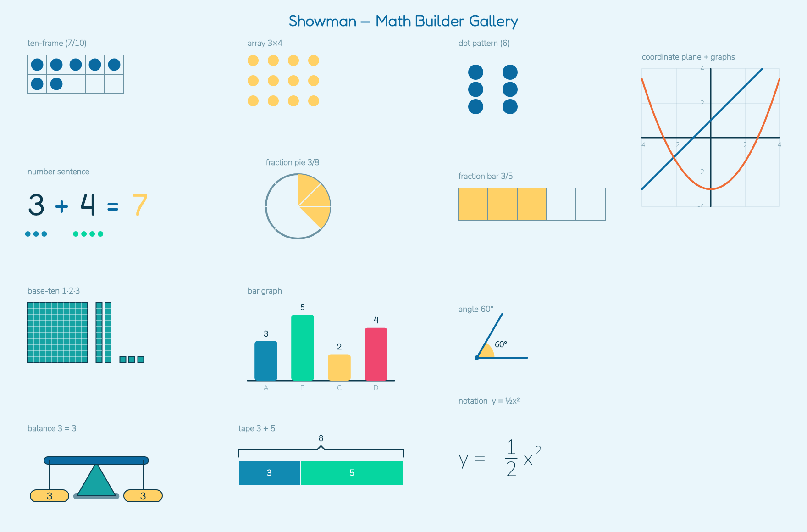
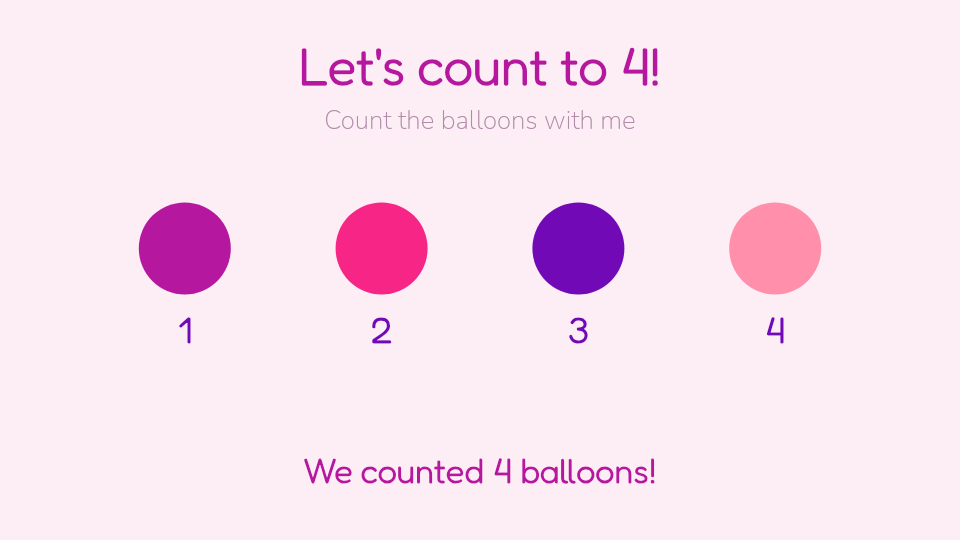

# Showman

An animation engine for **beautiful, narrated, pedagogically-structured learning
videos for children** — authored by AI agents. A teacher or an agent provides a
brief ("teach counting to five with stars", "graph y = 2x + 1"); Showman produces a
polished, warm, narrated, captioned animation a child can watch.

It now ships a **math animation toolkit spanning counting → algebra** — coordinate
planes and function graphs (lines & parabolas that draw themselves on), number
lines, fractions, ten-frames, arrays, place value, equations on a balance scale,
bar graphs, and lightweight math notation (`a/b`, `x²`).

All milestones **M0–M6** are implemented. See [MILESTONES.md](./MILESTONES.md) for
the breakdown, [IMPLEMENTATION_PLAN.md](./IMPLEMENTATION_PLAN.md) for the vision, and
[docs/PRODUCT_ROADMAP.md](./docs/PRODUCT_ROADMAP.md) for what's next (a PM feature map:
real voice, camera, interactivity, …).


## Architecture

```
            ┌──────────────── Control plane (Go) ───────────────┐
 agents ──▶ │  Gateway: capability API + auth/quota/bounds      │
 web app ─▶ │           + /metrics + CDN redirect               │
            └───────────────────────────────────────────────────┘
                   │                         │
            worker (TS)               coordinator (TS)
       validate/preview/schema     shard → queue → fan-in assemble
       /render (+ narration,       work-stealing shard workers (TS)
        captions, safety gate)            │
                   └──────── object storage (local / S3) ───────┘
```

- **TypeScript** owns the deterministic engine, render worker, distributed
  coordinator/workers/assembler, and the MCP adapter.
- **Go** owns the edge gateway (capability API + policy + observability).
- Everything speaks the **Scene Spec (JSON)**; languages meet only at JSON seams.

## What's here

| Milestone | What |
|---|---|
| **M0** | Scene Spec contract, structured validator, deterministic `(spec, frame) → pixels` renderer (Skia, pinned fonts, seeded RNG). |
| **M1** | Multi-core frame pool, `spec → mp4` via FFmpeg pipe, HTTP capability worker, Docker image. |
| **M2** | Streaming (fragmented mp4) + async jobs (submit → poll → result). |
| **M3** | Distributed rendering: Go gateway, sharded fan-out, work-stealing pull, fan-in assembler, **idempotent retry** (a sharded render is byte-identical to a monolithic one). |
| **M4** | MCP server (agent tools) + self-correcting authoring loop. |
| **M5** | Storytelling primitives, motion presets, themes, narration/TTS, captions, lesson templates, content-safety gate. |
| **M6** | Auth/quota/bounds, Prometheus metrics, CDN + HLS, Kubernetes manifests, CI. |
| **Math** | `arc` / `counter` / `polyline` engine primitives, a `src/math` toolkit of composite builders + math motion presets + narrated lessons spanning counting → quadratics. |

## Math toolkit (counting → algebra)

Beyond the core primitives, `src/math` adds composable, themeable math visuals and a
library of narrated lessons that compose them. The keystone primitive is `polyline`
(connected points with an animatable draw-on `progress`), which unlocks axes,
function curves, segments, braces, and tape diagrams; graphs precompute their sample
points at build time, so a spec stays pure JSON.



- **Builders:** `coordinatePlane` + `plotLine`/`plotFunction`/`plotPoints` (graphing),
  `numberLine`, `fractionCircle`/`fractionBar`, `tenFrame`, `baseTenBlocks`,
  `dotPattern`, `arrayGrid`, `numberSentence`, `mathExpr` (lightweight notation),
  `balanceScale`, `tapeDiagram`, `barGraph`, `angle`.
- **Motion presets:** `drawOn` (graphs draw themselves), `shadeIn` (fractions fill),
  `countUp`, `hop` (number-line jumps), `fillStagger`.
- **Lessons:** `buildMathLesson(topic, params)` dispatches to graphing, quadratic,
  addition, multiplication, fraction, place-value, equation, and data lessons —
  each a complete, narrated, captioned Scene Spec.

```ts
import { math } from "showman";

const lesson = math.buildMathLesson("graphing", { m: 2, b: 1, theme: "ocean" });
//            ^ the line y = 2x + 1 draws itself across a labeled coordinate plane
```

```bash
npm run math-gallery   # render every builder onto one contact sheet -> out/math-gallery.png
```

## Brief → video (the product goal)

One call turns a plain-English brief into a finished, narrated, captioned video.
With `ANTHROPIC_API_KEY`/`OPENROUTER_API_KEY` set it uses an LLM author; otherwise an
offline template author parses the brief (count, topic, theme, shape, **and math
intents** like "graph y = 2x + 1") deterministically. Set `OPENAI_API_KEY` or
`ELEVENLABS_API_KEY` for a **real spoken voice** (otherwise an offline tone) — clips
are cached on disk so repeats are free and reproducible.

```bash
npm run brief -- "teach counting to four balloons in a magical fairy land"
# -> out/brief-lesson.mp4   (the frame below was authored entirely from that brief)
```



```
POST /author { "brief": "..." }  -> 202 { jobId }   # author + submit in one call
GET  /jobs/{jobId}               -> { status, result.video }
```

## Quickstart

```bash
npm install
npm test              # 269 tests (unit + integration + golden + purity)
npm run demo:lesson   # render a narrated, captioned counting lesson -> out/
npm run math-gallery  # render the full math-builder gallery -> out/math-gallery.png

# Author a lesson programmatically
node -e "import('./dist/index.js')" # after `npm run build`
```

```ts
import { buildCountingLesson, RenderService, LocalObjectStorage,
         SilentTtsProvider, RuleBasedModeration } from "showman";

const lesson = buildCountingLesson({ count: 5, topic: "stars", theme: "sunshine", itemShape: "star" });
const storage = new LocalObjectStorage("data/objects");
const service = new RenderService({ storage, workDir: "data/tmp",
  tts: new SilentTtsProvider(), moderation: new RuleBasedModeration() });
const result = await service.render(lesson);   // { video, captions, hasAudio, ... } or { blocked } if unsafe
```

## Run the services

```bash
npm run build
npm run worker        # render worker        :8080  (/validate /preview /render /jobs /objects)
npm run coordinator   # sharding coordinator :8090  (/jobs /metrics)
npm run mcp           # MCP server over stdio (agent tools)

# Local cluster (needs Docker daemon)
docker compose up --build
curl -X POST localhost:8080/v1/jobs -d '{"spec": ...}'
```

## Agent interface (MCP)

The MCP server exposes `showman_get_schema`, `showman_validate_scene`,
`showman_preview_scene`, `showman_submit_render`, `showman_job_status`. An agent
reads the schema, authors a scene, previews a frame, self-corrects against
structured validation errors, and submits — see `src/authoring/agent.ts`.

## Key design decisions

| Decision | Choice | Why |
|---|---|---|
| Render backend | `@napi-rs/canvas` (Skia) | deterministic, no system deps |
| Keyframe time | seconds (not frames) | fps-independent; syncs narration |
| Determinism | seeded RNG only, pinned fonts, bitexact encode | safe parallelism + retry + caching |
| Control plane | Go gateway, TS coordinator/workers | JSON seams; pragmatic + tested |
| Storage / queue / jobs | interfaces (local/in-memory now) | Redis/Postgres/S3 adapters for scale |

## Develop

```bash
npm run typecheck                 # tsc --noEmit
npm run golden:update             # regenerate golden frames after an intentional change
cd control-plane && go test ./... # gateway tests
```

Determinism is enforced by tests: render-twice byte-equality, a golden-frame suite,
an engine **purity** scan (no clock / `Math.random`), and a proof that a
**distributed render equals a monolithic render byte-for-byte**.
