

# Showman

**Beautiful, narrated learning videos — rendered deterministically from a single spec.**

Give Showman a brief — *"teach counting to five with stars"*, *"graph y = 0.4x² − 2"*,
*"explain the request lifecycle"* — and it renders a polished, narrated, captioned video.
Every scene is a serializable **Scene Spec** turned into pixels by a pure
`(spec, frame) → pixels` function, so the same spec always produces the same frames,
byte-for-byte, on any machine.

**Every image on this page was rendered by the engine itself.**

---

## A parabola that draws itself on

Motion is built in: spring overshoots, staggered entrances, eased draw-on, and a keyframed
camera — so things *arrive* and *flow* instead of blinking into place.

---

## What it renders

|  |  |
| :---: | :---: |
| **Mathematics** — coordinate planes, lines, and self-drawing function graphs | **Charts** — bar / line / area / scatter / candlestick, with round axis ticks |
|  | 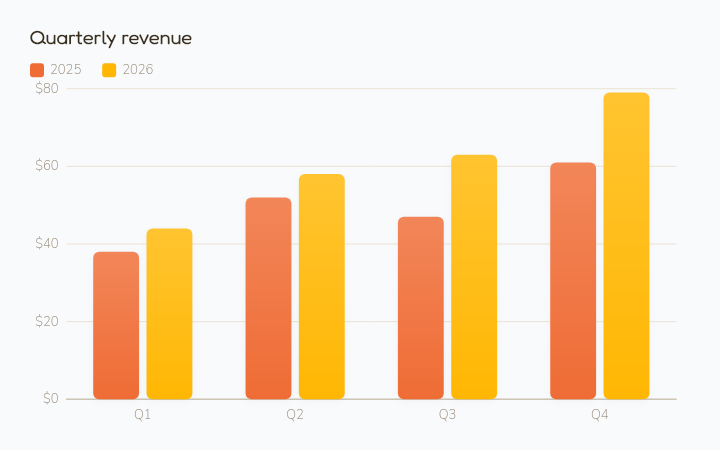 |
| **Diagrams** — flowcharts, connectors, shapes, and data tables | **Code** — syntax-highlighted editor cards that type themselves in |
|  | 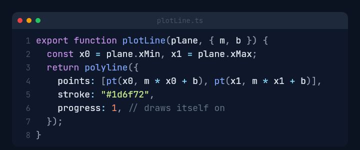 |
| **Chemistry** — CPK molecules and balanced reaction equations | **Physics** — free-body diagrams and circuit schematics with flowing current |
| 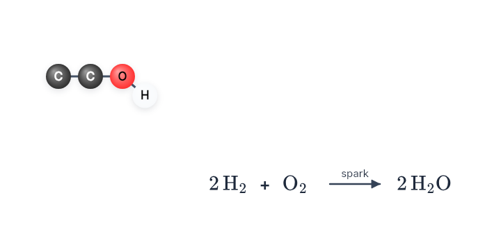 | 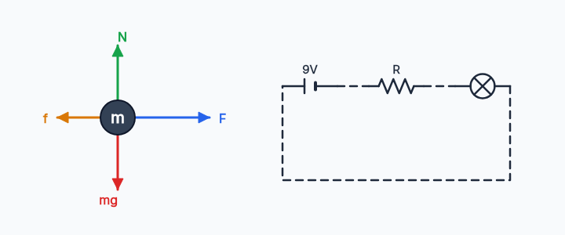 |
| **White-label** — derive a full theme from one brand color | **Assessment** — quiz cards with misconception-aware answers |
| 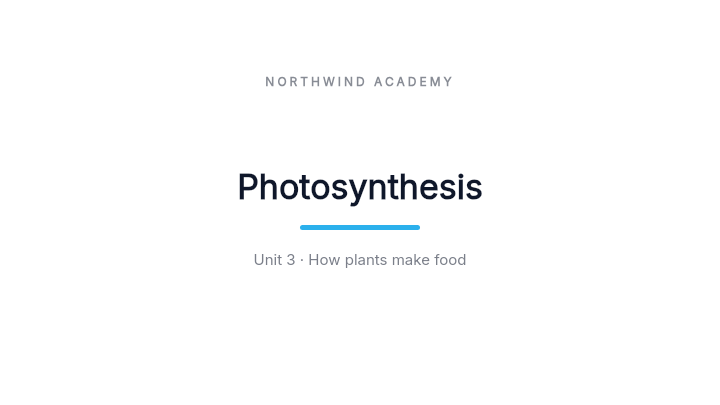 | 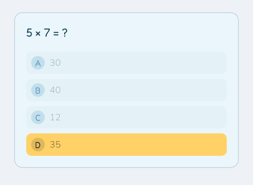 |
| **Icons** — a crisp, frozen line-art set | **Lessons** — warm, narrated, age-appropriate scenes |
| 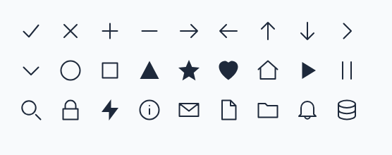 |  |

---

## Science, in depth

Chemistry and physics go well beyond a single figure — molecular structure, reactions and energetics,
mechanics, fields, optics, and atomic models, all exact and all engine-rendered.

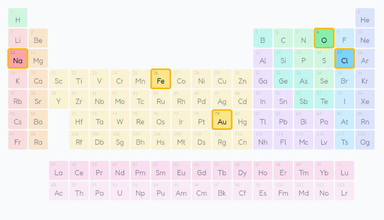

|  |  |
| :---: | :---: |
| **Energetics** — reaction-coordinate diagrams + the pH scale | **Optics** — thin-lens ray diagrams with real image formation |
| 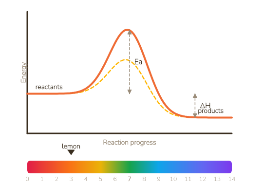 | 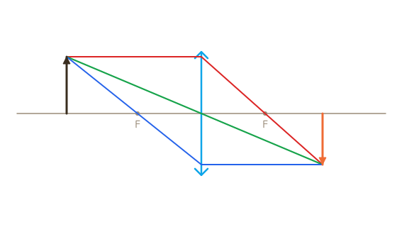 |
| **Mechanics** — projectile motion with synced energy bars | **Apparatus** — free-body diagrams + live circuit schematics |
| 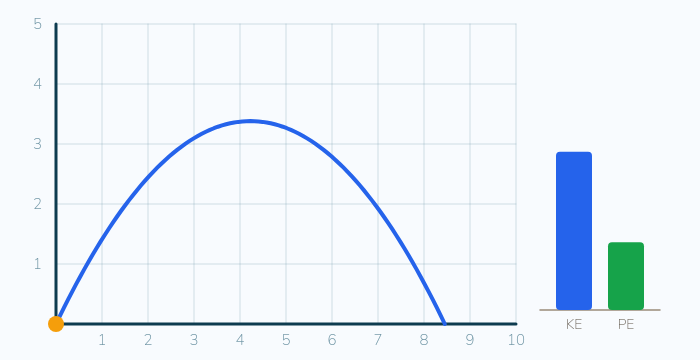 |  |

Plus Lewis structures, VSEPR geometry, electron configurations, Bohr atoms, titration / heating /
phase diagrams, vector fields, oscillators, and energy-level diagrams.

---

## Beautiful by default

Gradients, soft shadows, film-grain backdrops, and LaTeX-quality typography come standard —
and every element is themeable, so the same lesson can read as a playful primary-school scene
or a restrained graduate explainer just by switching the palette.

- **Fluid motion** — a full easing library (springs, elastic, expo, circ) plus presets for
  pop-in, stagger, path-following, and self-writing strokes.
- **Clean composition** — round chart ticks, theme-aware gridlines, contrast-safe text, and
  pixel-honest vector rendering.
- **Cinematic camera** — keyframed pan and zoom that push in on the detail that matters.
- **K-12 → college → STEM** — counting and fractions through quadratics, chemistry, physics,
  finance charts, and code.

*From a five-year-old's first count to a graduate seminar — one engine, one spec, every frame identical.*

