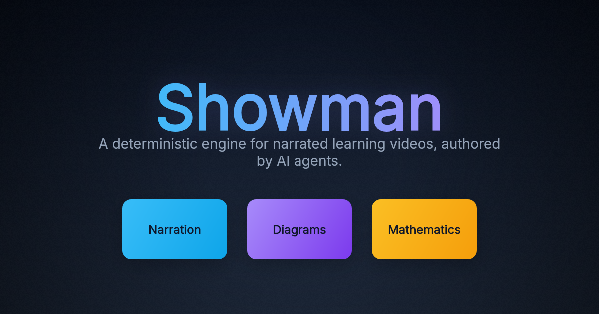
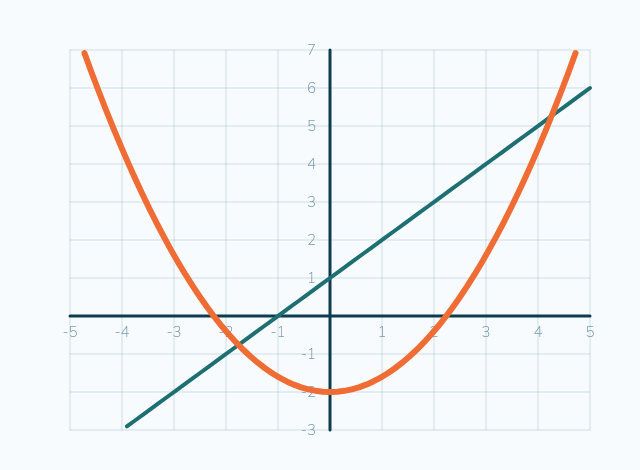
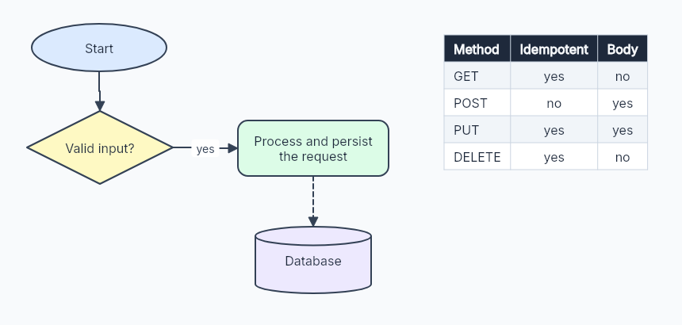
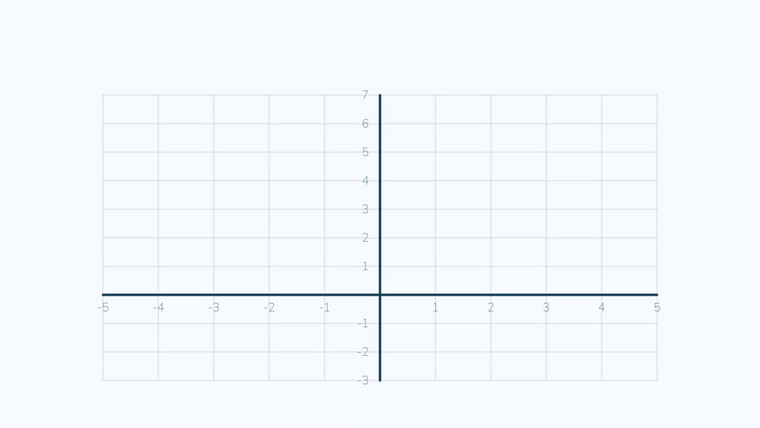

<div align="center">

# Showman

**A deterministic engine for narrated learning videos, authored by AI agents.**



</div>

A teacher or an agent gives Showman a brief — *"teach counting to five with stars"*,
*"graph y = 2x + 1"*, *"explain the request lifecycle"* — and it renders a polished,
narrated, captioned video. Every scene is a serializable **Scene Spec (JSON)** turned
into pixels by a pure `(spec, frame) → pixels` function, so the same spec always produces
the same frames: byte-for-byte, on any machine, whether rendered on one core or sharded
across a cluster and retried.

The range runs from a warm counting lesson for a five-year-old to a clean technical
explainer for a graduate seminar — coordinate planes and self-drawing function graphs,
flowcharts and data tables, gradient-lit typography, and real spoken narration.

---

## A short tour

|  |  |
|:--:|:--:|
|  |  |
| **Mathematics** — labeled planes, lines, and parabolas that draw themselves on | **Diagrams** — flowcharts, arrows, and measured data tables |
|  |  |
| **Lessons** — warm, narrated, captioned, and safe by construction | **Animation** — keyframed and frame-exact, the same on every run |

## Beautiful by default

- **Typography** — three pinned, license-clean type families (Inter, Source Serif 4,
  JetBrains Mono) beside the rounded children's faces; real multi-line text with
  word-wrap, line height, and letter spacing; a layout grid and slide templates.
- **Paint** — linear and radial gradients on any fill or text, drop shadows and glows,
  dashed and animated strokes, and a cinematic backdrop system (gradient, vignette, and
  seeded film grain) — all byte-identical across platforms.
- **Motion** — keyframed property tracks in seconds (fps-independent), a deep easing
  library, draw-on for paths and graphs, shape morphing, scene transitions, and
  per-node compositing (blend, blur, clip).

## Teaching primitives

- **Mathematics** — `coordinatePlane` with `plotLine` / `plotFunction` / `plotPoints`,
  number lines, fractions, ten-frames, arrays, place value, equations on a balance
  scale, bar graphs, and lightweight notation (`a/b`, `x²`). Graphs precompute their
  sample points at build time, so a spec stays pure JSON.
- **Diagrams** — `connector` (straight / elbow / curved routing, arrowheads, labels),
  seven `box` shapes for flowchart / UML / ER (including a database cylinder), a measured
  `table`, and a `flowchart` composer that auto-routes between node ports.
- **Typesetting** — LaTeX rendered through MathJax into morphable glyph paths, so an
  equation is first-class, animatable geometry.

## Narration, captions, and safety

A scene's narration is synthesized to a spoken track and aligned into `VTT` / `SRT`
captions. Voice comes from OpenAI or ElevenLabs in the cloud, or from **Kokoro** running
free and locally on your GPU; clips are content-addressed and cached, so repeats are free
and reproducible. Every lesson passes a content-safety gate before it renders.

## From a brief to a video

One call turns plain English into a finished video. With `ANTHROPIC_API_KEY` or
`OPENROUTER_API_KEY` set it uses an LLM author; otherwise an offline template author
parses the brief — count, topic, theme, shape, and math intents like *"graph y = 2x + 1"*
— deterministically.

```bash
npm run brief -- "teach counting to four balloons in a magical fairy land"
# -> out/brief-lesson.mp4
```

```
POST /author { "brief": "..." }  -> 202 { jobId }   # author and submit in one call
GET  /jobs/{jobId}               -> { status, result.video }
```

## Architecture

```
            ┌──────────────── Control plane (Go) ───────────────┐
 agents ──▶ │  Gateway: capability API + auth/quota/bounds      │
 web app ─▶ │           + /metrics + CDN redirect               │
            └───────────────────────────────────────────────────┘
                   │                         │
            worker (TS)               coordinator (TS)
       validate/preview/schema     shard → queue → fan-in assemble
       /render (+ narration,       work-stealing shard workers (TS)
        captions, safety gate)            │
                   └──────── object storage (local / S3) ───────┘
```

- **TypeScript** owns the deterministic engine, the render worker, the distributed
  coordinator / workers / assembler, and the MCP adapter.
- **Go** owns the edge gateway — the capability API, policy, and observability.
- Everything speaks the **Scene Spec (JSON)**; the languages meet only at JSON seams.

## Quickstart

```bash
npm install
npm test              # the full suite: unit, integration, golden frames, and a purity scan
npm run demo:lesson   # render a narrated, captioned counting lesson -> out/
npm run math-gallery  # render every math builder onto one contact sheet -> out/
```

```ts
import { buildCountingLesson, RenderService, LocalObjectStorage,
         SilentTtsProvider, RuleBasedModeration } from "showman";

const lesson = buildCountingLesson({ count: 5, topic: "stars", theme: "sunshine", itemShape: "star" });
const storage = new LocalObjectStorage("data/objects");
const service = new RenderService({ storage, workDir: "data/tmp",
  tts: new SilentTtsProvider(), moderation: new RuleBasedModeration() });
const result = await service.render(lesson);   // { video, captions, hasAudio, ... } or { blocked } if unsafe
```

## Run the services

```bash
npm run build
npm run worker        # render worker        :8080  (/validate /preview /render /jobs /objects)
npm run coordinator   # sharding coordinator :8090  (/jobs /metrics)
npm run mcp           # MCP server over stdio (agent tools)

# Local cluster (needs the Docker daemon)
docker compose up --build
curl -X POST localhost:8080/v1/jobs -d '{"spec": ...}'
```

## Agent interface (MCP)

The MCP server exposes `showman_get_schema`, `showman_validate_scene`,
`showman_preview_scene`, `showman_submit_render`, and `showman_job_status`. An agent reads
the self-describing schema, authors a scene, previews a frame, self-corrects against
structured validation errors, and submits — see `src/authoring/agent.ts`.

## Key design decisions

| Decision | Choice | Why |
|---|---|---|
| Render backend | `@napi-rs/canvas` (Skia) | deterministic, no system dependencies |
| Keyframe time | seconds, not frames | fps-independent; syncs to narration |
| Determinism | seeded RNG only, pinned fonts, bit-exact encode | safe parallelism, retry, and caching |
| Generated assets | content-addressed "generate then freeze" | stochastic models stay out of the render path |
| Control plane | Go gateway, TypeScript coordinator and workers | JSON seams; pragmatic and tested |
| Storage / queue / jobs | interfaces (local and in-memory today) | Redis / Postgres / S3 adapters for scale |

## Develop

```bash
npm run typecheck                 # tsc --noEmit
npm run golden:update             # regenerate golden frames after an intentional change
npx tsx scripts/readme-media.ts   # regenerate the images and demo on this page
cd control-plane && go test ./... # gateway tests
```

Determinism is enforced by tests: render-twice byte-equality, a golden-frame suite, an
engine **purity** scan (no clock, no `Math.random`), and a proof that a distributed render
equals a monolithic render byte-for-byte.
